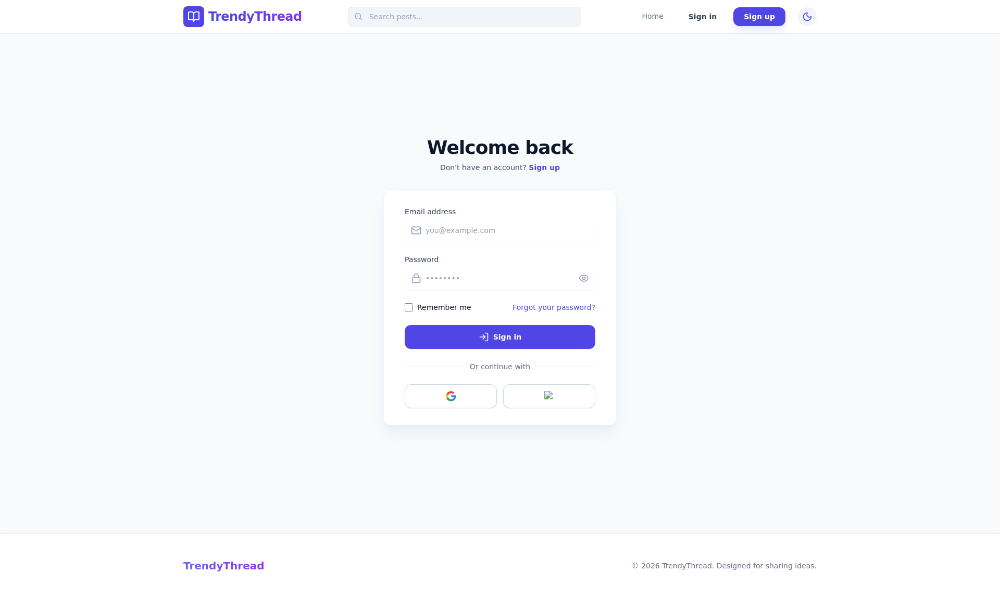
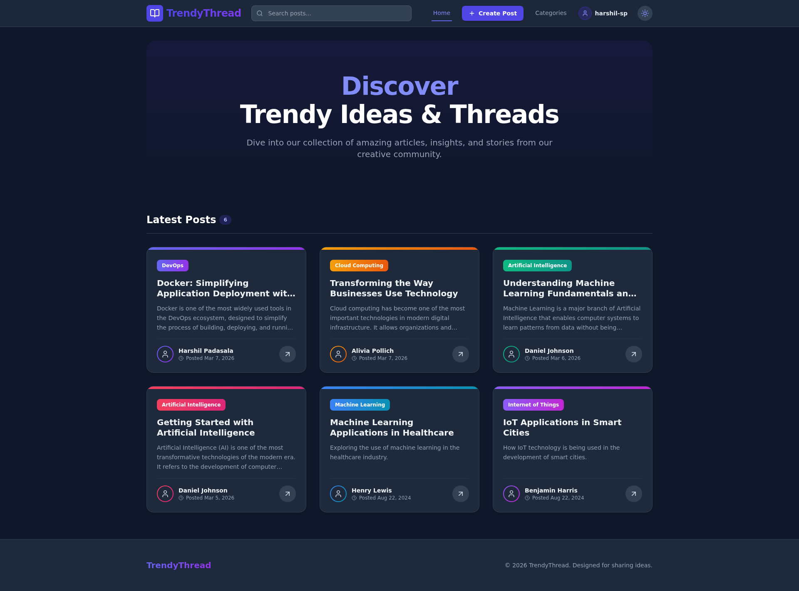
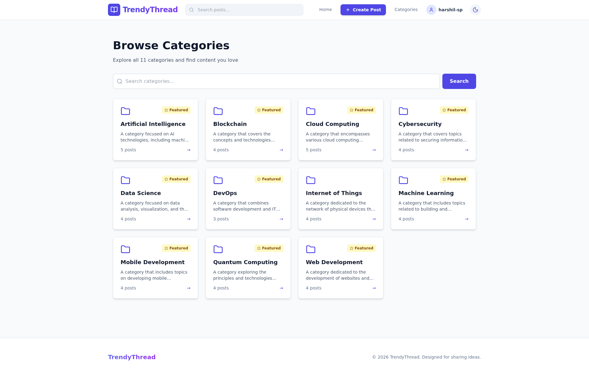
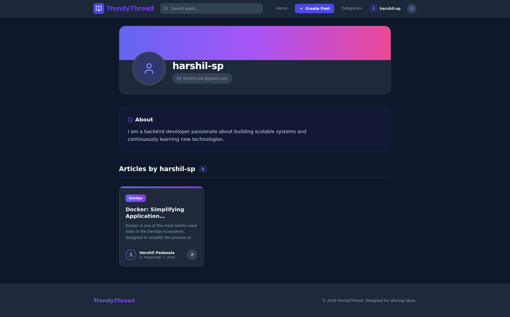
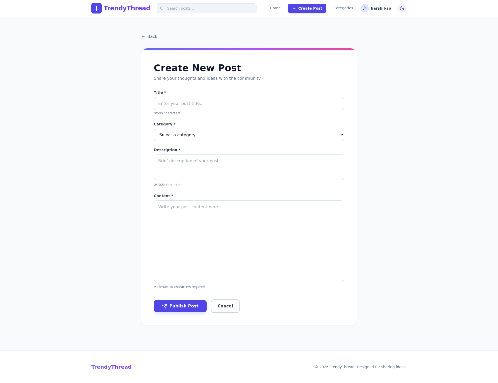
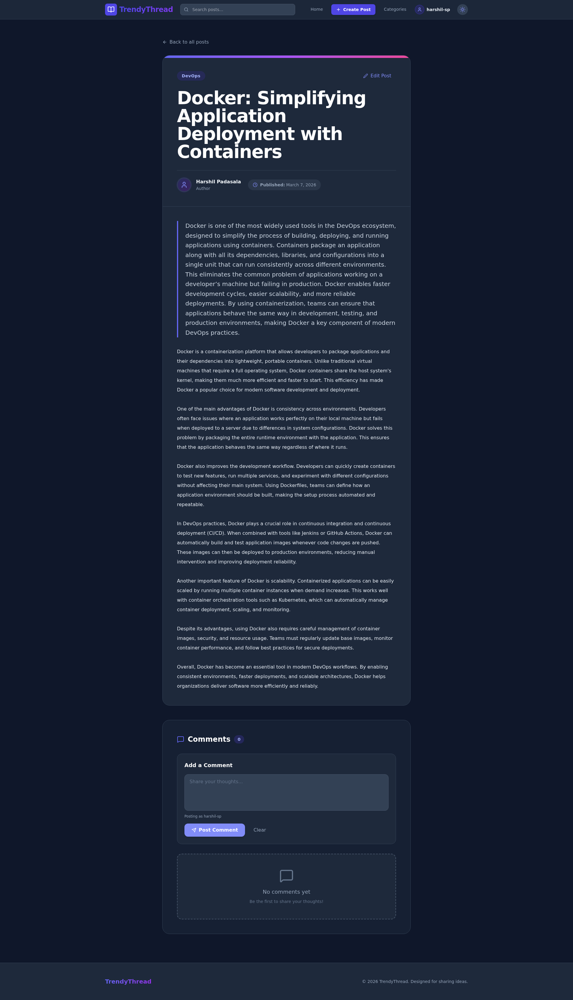
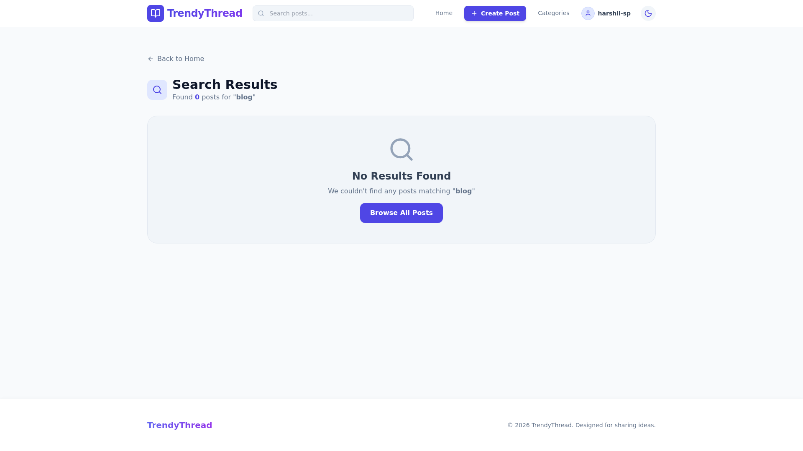

# 🎨 TrendyThread Blog Application - Frontend (React)

A modern, responsive blog application built with React 19, featuring a beautiful UI with Tailwind CSS, JWT authentication, and comprehensive blog management capabilities.

## 📸 Screenshots

All screenshots are captured in **dark mode** with desktop resolution (1920x1080).

### Public Pages (Before Authentication)

#### Landing Page (Dark Mode)


#### Login Interface (Dark Mode)


### Authenticated Pages (After Login)

#### Home Page with Posts Feed


#### Categories Listing


#### User Profile


#### Create New Post


#### Post Detail with Comments


#### Search Results


> 📝 All screenshots showcase the complete application in dark mode, including both public and authenticated pages.

## 🌟 Features

### User Experience
- 🎨 **Modern UI**: Beautiful gradient-based design with smooth animations
- 🌓 **Dark Mode**: Full dark mode support with context-based theme management
- 📱 **Responsive**: Optimized for all screen sizes (mobile, tablet, desktop)
- ⚡ **Fast**: React 19 with optimized rendering and lazy loading
- 🎭 **Animations**: Smooth transitions and hover effects using Tailwind

### Authentication & Authorization
- 🔐 **JWT Authentication**: Secure login and signup with token-based auth
- 🔒 **Protected Routes**: Automatic redirection for authenticated/public routes
- 👤 **User Context**: Global authentication state with React Context
- 💾 **Persistent Sessions**: Token storage in localStorage
- 🚪 **Auto Logout**: Automatic logout on token expiration

### Blog Features
- 📝 **Create Posts**: Rich post creation with title, description, and content
- ✏️ **Edit Posts**: Update your own posts with ownership validation
- 👁️ **View Posts**: Beautiful post detail pages with author info
- 🏷️ **Categories**: Filter and browse posts by category
- 💬 **Comments**: Add, edit, and view comments on posts
- 🔍 **Search**: (Coming soon) Search posts by keywords
- 📊 **User Profiles**: View any user's posts and profile information

### Dynamic UI Components
- **Post Cards**: Gradient-accented cards with hover effects and animations
- **Comment Cards**: Matching design with inline edit functionality
- **Navigation**: Responsive navbar with conditional rendering
- **Forms**: Validated forms with loading states and error handling
- **Feedback**: Toast notifications and error messages

## 🛠️ Technology Stack

- **Framework**: React 19.2.4
- **Routing**: React Router DOM 7.13.1
- **Styling**: Tailwind CSS 3.4.19
- **HTTP Client**: Axios 1.13.6
- **Icons**: Lucide React 0.575.0
- **Build Tool**: Create React App / React Scripts 5.0.1
- **Package Manager**: npm

## 📋 Prerequisites

- Node.js 16+ 📦
- npm or yarn 🔧
- Backend API running on `http://localhost:8080` 🔗

## 🚀 Getting Started

### 1. Clone the Repository

```bash
git clone https://github.com/harshil-padasala/TrendyThread.git
cd trendy-thread-react
```

###  2. Install Dependencies

```bash
npm install
```

### 3. Configure API Endpoint

Update the API base URL in `src/services/api.js`:

```javascript
const API_BASE_URL = 'http://localhost:8080/api/v1';
```

### 4. Start Development Server

```bash
npm start
```

The app will open at `http://localhost:3000`


### 5. Build for Production

```bash
npm run build
```

Production-ready files will be in the `build/` folder.

## 📁 Project Structure

```
src/
├── components/          # Reusable UI components
│   ├── Navbar.jsx       # Navigation bar with auth state
│   └── PostCard.jsx     # Blog post card component
├── context/             # React Context providers
│   ├── AuthContext.js   # Authentication state management
│   └── ThemeContext.js  # Dark mode state management
├── pages/               # Page components (routes)
│   ├── Home.jsx         # Homepage with post grid
│   ├── Landing.jsx      # Landing page for guests
│   ├── Login.jsx        # Login page
│   ├── PostDetail.jsx   # Post detail with comments
│   ├── CategoryView.jsx # Category-filtered posts
│   ├── UserProfile.jsx  # User profile and posts
│   └── CreatePost.jsx   # Create new post form
├── services/            # API service modules
│   ├── api.js           # Axios instance with interceptors
│   ├── authService.js   # Authentication APIs
│   ├── postService.js   # Post management APIs
│   ├── commentService.js# Comment management APIs
│   ├── categoryService.js# Category APIs
│   └── userService.js   # User APIs
├── App.js               # Main app component with routing
├── index.js             # App entry point
└── index.css            # Global styles and Tailwind imports
```

## 🎨 Key Features Explained

### Authentication Flow

```javascript
// Login flow
1. User submits credentials
2. API returns JWT token + user data
3. Token stored in localStorage
4. Axios interceptor adds token to all requests
5. User context updated globally
```

**Automatic Logout:**
- 401 responses trigger logout
- Token removed from localStorage
- User redirected to login
- Custom event dispatches to all contexts

### Post Management

**Creating a Post:**
1. Navigate to "Create Post" (authenticated users only)
2. Fill in title (4-500 chars), description (10-1000 chars), content (10+ chars)
3. Select a category
4. Submit to create

**Editing a Post:**
1. "Edit Post" button appears only on YOUR posts
2. Click to enter edit mode
3. Modify fields inline
4. Save changes (backend validates ownership)

### Comment System

**Adding Comments:**
- Available only to authenticated users
- Inline form below post content
- Real-time validation

**Editing Comments:**
- Edit button appears only on YOUR comments
- Click pencil icon to edit
- Save/Cancel buttons in edit mode
- Backend validates ownership (403 if not owner)

### Ownership Validation

**Frontend:**
```javascript
const isOwner = user.username === post.blogger.email;
// Show edit button only if isOwner is true
```

**Backend:**
- Server validates ownership on UPDATE/DELETE
- Returns 403 FORBIDDEN if user doesn't own the content
- Ensures data integrity and security

## 🎯 Available Routes

| Route | Component | Description | Auth Required |
|-------|-----------|-------------|---------------|
| `/` | Home | List all posts | ❌ |
| `/landing` | Landing | Landing page for guests | ❌ |
| `/login` | Login | Login form | ❌ |
| `/signup` | (Landing) | Signup form | ❌ |
| `/posts/:id` | PostDetail | View post with comments | ❌ |
| `/category/:id` | CategoryView | Posts by category | ❌ |
| `/user/:id` | UserProfile | User's posts | ❌ |
| `/create-post` | CreatePost | Create new post | ✅ |

## 🔐 API Integration

### Axios Configuration

**Request Interceptor** (adds JWT token):
```javascript
api.interceptors.request.use(config => {
  const user = JSON.parse(localStorage.getItem('user'));
  if (user?.token) {
    config.headers.Authorization = `Bearer ${user.token}`;
  }
  return config;
});
```

**Response Interceptor** (handles 401):
```javascript
api.interceptors.response.use(
  response => response,
  error => {
    if (error.response?.status === 401) {
      localStorage.removeItem('user');
      window.dispatchEvent(new Event('unauthorized'));
    }
    return Promise.reject(error);
  }
);
```

### Service Methods

**postService.js:**
```javascript
fetchAll()           // GET /posts
fetchLatest(limit)   // GET /posts/latest
fetchById(id)        // GET /posts/{id}
fetchByCategory(id)  // GET /posts/category/{id}
fetchByUser(userId)  // GET /posts/user/{userId}
fetchMyPosts()       // GET /posts/blogger (authenticated)
create(data, catId)  // POST /posts/category/{catId}
update(id, data)     // PUT /posts/{id}
remove(id)           // DELETE /posts/{id}
```

**commentService.js:**
```javascript
fetchByPostId(postId)           // GET /posts/{postId}/comments
create(postId, data)            // POST /posts/{postId}/comments
update(postId, commentId, data) // PUT /posts/{postId}/comments/{id}
remove(postId, commentId)       // DELETE /posts/{postId}/comments/{id}
```

## 🎨 Styling & Design

### Tailwind CSS Configuration

**Gradient Colors:**
- `from-indigo-500 to-purple-600`
- `from-purple-500 to-pink-600`
- `from-blue-500 to-cyan-600`
- `from-rose-500 to-pink-600`
- `from-emerald-500 to-teal-600`
- `from-amber-500 to-orange-600`

**Dark Mode:**
- Uses Tailwind's `dark:` variant
- Context-based theme switching
- Persists preference in localStorage

### Component Patterns

**Post Card:**
```jsx
- Gradient accent bar (rotates by index)
- Hover effects (-translate-y-2, shadow-2xl)
- Gradient category badge
- Author avatar with gradient ring
- Read time + date display
- Rotating arrow icon on hover
```

**Comment Card:**
```jsx
- Matches post card gradient theme
- Author info with avatar
- "You" badge for own comments
- Edit button (owner only)
- Inline edit mode with textarea
- Save/Cancel buttons
```

## 🧪 Testing

Run tests:
```bash
npm test
```

Test files are located in `src/*.test.js` using:
- `@testing-library/react`
- `@testing-library/jest-dom`
- `@testing-library/user-event`

## 📦 Building & Deployment

### Build Production Bundle

```bash
npm run build
```

Output: Optimized files in `build/` folder

### Deploy to Hosting

**Netlify:**
```bash
npm run build
# Drag build folder to Netlify
```

**Vercel:**
```bash
vercel --prod
```

**GitHub Pages:**
```bash
npm install gh-pages --save-dev
# Add to package.json: "homepage": "https://username.github.io/repo"
npm run build
npx gh-pages -d build
```

## 🔧 Environment Variables

Create `.env` file in the root:

```env
REACT_APP_API_BASE_URL=http://localhost:8080/api/v1
REACT_APP_NAME=TrendyThread
```

Access in code:
```javascript
const apiUrl = process.env.REACT_APP_API_BASE_URL;
```

## 🐛 Troubleshooting

### CORS Errors
Ensure the backend allows requests from `http://localhost:3000`:
```java
@CrossOrigin(origins = "http://localhost:3000")
```

### Token Not Sent
Check localStorage contains user object with token:
```javascript
console.log(JSON.parse(localStorage.getItem('user')));
```

### 401 Unauthorized
- Token might be expired
- Backend might not be running
- Check network tab for request headers

## 📚 Learn More

- [React Documentation](https://react.dev/)
- [React Router](https://reactrouter.com/)
- [Tailwind CSS](https://tailwindcss.com/)
- [Axios](https://axios-http.com/)
- [Lucide Icons](https://lucide.dev/)

## 🎯 Future Enhancements

- [ ] Post search functionality
- [ ] Rich text editor for post content
- [ ] Image upload for posts
- [ ] User avatar uploads
- [ ] Email verification
- [ ] Password reset
- [ ] Social media sharing
- [ ] Like/favorite posts
- [ ] Bookmark posts
- [ ] Notifications
- [ ] Infinite scroll
- [ ] Post drafts

## 🤝 Contributing

1. Fork the repository
2. Create a feature branch (`git checkout -b feature/NewFeature`)
3. Commit your changes (`git commit -m 'Add NewFeature'`)
4. Push to the branch (`git push origin feature/NewFeature`)
5. Open a Pull Request

## 📄 License

This project is open source and available under the MIT License.

## 👨‍💻 Author

**Harshil Padasala**
- GitHub: [@harshil-padasala](https://github.com/harshil-padasala)

## 🙏 Acknowledgments

- Create React App team
- Tailwind CSS team
- Lucide Icons contributors
- All open-source contributors

---

**Made with ❤️ using React and Tailwind CSS**

**Happy Coding! 🚀**
